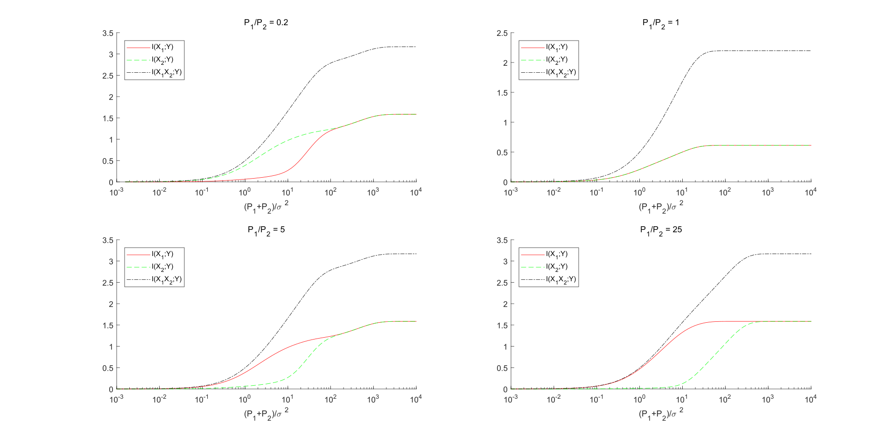
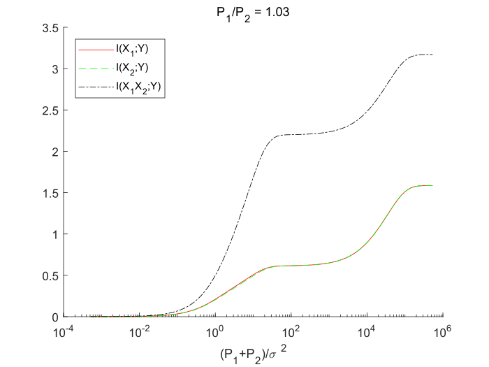

# 第一次编程实验

> 无 76    RainEggplant    2017******


## 解题思路

根据 $X_1$, $X_2$ 的分布，得到其均方为 $P_1=\frac{8}{3} A_1^2,$ $P_2=\frac{8}{3} A_2^2$。噪声 $N \sim N(0, \sigma ^2)$。

由 $Y=X_1+X_2+N$, 可得 Y 的概率密度函数为 $f_Y=f_{X_1}*f_{X_2}*f_{N}$。

由于 $f_{X_1}(x)=\frac{1}{3}(\delta(x+2A_1)+\delta(x)+\delta(x-2A_1))$,  $f_{X_2}(x)=\frac{1}{3}(\delta(x+2A_2)+\delta(x)+\delta(x-2A_2))$,

故 
$$
\begin{align*}
f_Y(y) = \frac{1}{9}( &f_N(y+2A_1+2A_2)+f_N(y+2A_1)+f_N(y+2A_1-2A_2)+ \\
&f_N(y+2A_2)+f_N(y)+f_N(y-2A_2)+\\
&f_N(y-2A_1+2A_2)+f_N(y-2A_1)+f_N(y-2A_1-2A_2))
\end{align*}
$$
其中
$$
f_N(y)=\frac{1}{\sqrt{2 \pi} \sigma} exp(\frac{y^2}{2 \sigma^2})
$$
从而可以通过下式计算
$$
H(Y)=- \int_{- \infty}^{+\infty}f_Y(y) \mathrm{log_2}(f_Y(y))
$$
因为 $H(Y|X_1)=H(Y-X_1)=H(X_2+N)$,  $H(Y|X_2)=H(X_1+N)$, $H(Y|X_1X_2)=H(N)$, 所以可以采用类似的思路求得其概率密度函数，然后求得对应的条件熵。

最后，便可以根据如下公式计算平均互信息：
$$
I(X_1;Y)=H(Y)-H(Y|X_1) \\
I(X_2;Y)=H(Y)-H(Y|X_2) \\
I(X_1X_2;Y)=H(Y)-H(Y|X_1X_2)
$$


根据以上思路，编写 MATLAB 程序（`solution.m`），内容如下：

```matlab
%% Calculate results
% 取噪声的标准差 sigma = 1 作为基准
ratio = [0.2, 1, 5, 25]; % x1, x2 均方之比
A1 = logspace(-2, 2, 100)';
A1 = repmat(A1, 1, 4);
A2 = A1./sqrt(ratio);

P1 = 8/3*A1.^2;
%P2 = 8/3*A2.^2;
P2 = P1./ratio;
P = P1+P2; % 总信号功率

% 定义高斯噪声的概率密度函数
f_N = @(x, u, s) 1/(sqrt(2*pi)*s)*exp(-(x-u).^2./(2*s^2));

% 信道输出 Y, Y|X1, Y|X2, Y|X1X2 的概率密度函数
f_Y = @(x) ...
    1/9 * (...
    f_N(x, -2*A1-2*A2, 1) + f_N(x, -2*A1, 1) + f_N(x, -2*A1+2*A2, 1) + ...
    f_N(x, -2*A2, 1) + f_N(x, 0, 1) + f_N(x, 2*A2, 1) + ...
    f_N(x, 2*A1-2*A2, 1) + f_N(x, 2*A1, 1) + f_N(x, 2*A1+2*A2, 1) ...
    );
f_Y_g_X1 =  @(x) ...
    1/3 * (f_N(x, -2*A2, 1) + f_N(x, 0, 1) + f_N(x, 2*A2, 1));
f_Y_g_X2 =  @(x) ...
    1/3 * (f_N(x, -2*A1, 1) + f_N(x, 0, 1) + f_N(x, 2*A1, 1));
f_Y_g_X1X2 =  @(x) f_N(x, 0, 1);

% 熵的被积表达式
fi_H_Y = @(x) max(-f_Y(x).*log2(f_Y(x)), 0);
fi_H_Y_g_X1 = @(x) max(-f_Y_g_X1(x).*log2(f_Y_g_X1(x)), 0);
fi_H_Y_g_X2 = @(x) max(-f_Y_g_X2(x).*log2(f_Y_g_X2(x)), 0);
fi_H_Y_g_X1X2 =  @(x) max(-f_Y_g_X1X2(x).*log2(f_Y_g_X1X2(x)), 0);

% 熵
H_Y = integral(fi_H_Y, -inf, inf, 'ArrayValued', true);
H_Y_g_X1 = integral(fi_H_Y_g_X1, -inf, inf, 'ArrayValued', true);
H_Y_g_X2 = integral(fi_H_Y_g_X2, -inf, inf, 'ArrayValued', true);
H_Y_g_X1X2 = integral(fi_H_Y_g_X1X2, -inf, inf, 'ArrayValued', true);

% 平均互信息
I_X1_Y = H_Y-H_Y_g_X1;
I_X2_Y = H_Y-H_Y_g_X2;
I_X1X2_Y = H_Y-H_Y_g_X1X2;

%% Plot results
figure;
for k = 1:4
    ax = subplot(2, 2, k);
    hold on;
    plot(P(:, k), I_X1_Y(:, k), 'r');
    plot(P(:, k), I_X2_Y(:, k), '--g');
    plot(P(:, k), I_X1X2_Y(:, k), '-.k');
    legend('I(X_1;Y)', 'I(X_2;Y)', 'I(X_1X_2;Y)', ...
        'Location', 'northwest');
    ax.XScale = 'log';
    title(['P_1/P_2 = ', num2str(ratio(k))]);
    xlabel('(P_1+P_2)/\sigma ^2');
    xlim([1e-3, 1e4]);
end
```


## 结果分析

**程序的执行结果如下：**



**我们可以观察到如下现象：**

1. $P_1/P_2$ 不变时，随着总信噪比 $(P_1+P_2)/\sigma ^2$ 的增加，三个互信息量先迅速增加，然后趋于一极限值。
2. 当总信噪比较小时，$P_1/P_2$ 越大，$I(X_1;Y)$ 就越大，$I(X_2;Y)$ 就越小。但当总信噪比很大时，$I(X_1;Y)$ 和 $I(X_2;Y)$ 都将趋于相同极限值。
3. 当 $P_1/P_2 \ne 1$ 时，互信息量的极限值有 $I(X_1;Y)=I(X_2;Y)=\frac{1}{2} I(X_1X_2;Y)$。但当 $P_1/P_2=1$ 时，该式不成立，并且互信息量整体也更小。

**分析以上现象的原因：**

定性思考，信噪比越大，则噪声的影响就越不明显，因此信道就越能保证传递信息的准确，从而互信息量就越大。同时，互信息量的上限应当是信源的熵。

在本题中，由于有两个独立信源，而且这两个信源的熵都为 $H(X_1)=H(X_2)=\mathrm{log}_2(3) \approx 1.585$ bit。故当  $(P_1+P_2)/\sigma ^2 \rightarrow +\infty$ 时，如果两信源的信号满足不混叠，即 $A_1 \ne A_2 \Rightarrow P_1 \ne P_2$ ，则二者可以确定地区分开。因此按照我们的分析，$I(X_1;Y) \rightarrow H(X_1) \approx 1.585$ bit,  $I(X_2;Y) \rightarrow H(X_2) \approx 1.585$ bit, $I(X_1X_2;Y) \rightarrow H(X_1)+H(X_2) \approx 3.170$ bit。与绘图数据比对，我们的分析是正确的。

只要 $A_1 \ne A_2 \Rightarrow P_1 \ne P_2$ , 互信息量就可以达到上述极限。我们还可以取 $P_1/P_2$ 为接近 1 的值进行验证，例如 $P_1/P_2 = 1.03$ :



当 $A_1=A_2=A \Rightarrow P_1=P_2$ 时，互信息量可达到另一个更小的极限。分析如下：

$X_1$ 和 $X_2$ 有相同的概率密度函数 $f_X(x)$, 二者之和 $X_1+X_2$ 的概率密度函数
$$
\begin{align*}
f_{X_1+X_2}(x) = &f_{X}(x)*f_{X}(x) \\
=&\frac{1}{9}(\delta(x+4A)+\delta(x-4A))+\frac{2}{9}(\delta(x+2A)+\delta(x-2A))+\frac{1}{3}\delta(x)
\end{align*}
$$
可算得其信息量为 $H(X_1+X_2)\approx 2.197$ bit, 和第一幅图中 $P_1/P_2=1$ 时 $I(X_1X_2;Y)$ 的极限值吻合。

由于当 $(P_1+P_2)/\sigma ^2 \rightarrow +\infty$ 时，噪声的影响可以认为能够完全识别，从而 $H(Y|X_1)=H(X_2+N) \rightarrow H(X_2)+H(N)=H(X_2)+H(Y|X_1X_2)$, 因此，$I(X_1;Y)=H(Y)-H(Y|X_1) \rightarrow H(Y)-H(X_2)-H(Y|X_1X_2)=0.612$ bit, 与图形吻合。 $I(X_2;Y)$ 亦同理可得。


## 注意

上面的分析遗漏了 $P_1:P_2=0.25$ 或 $4$ 的情况，此时也会发生重叠，导致互信息量减少！