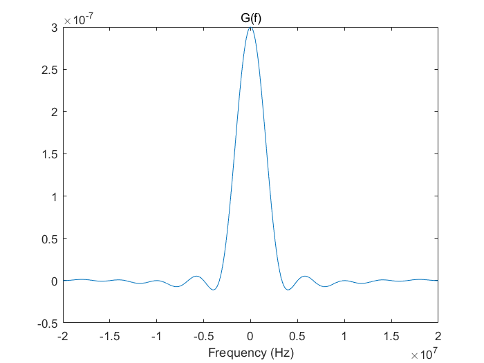
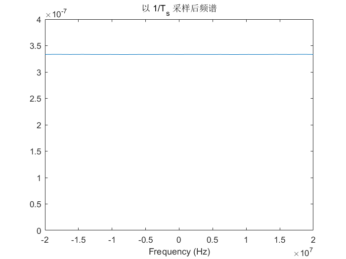
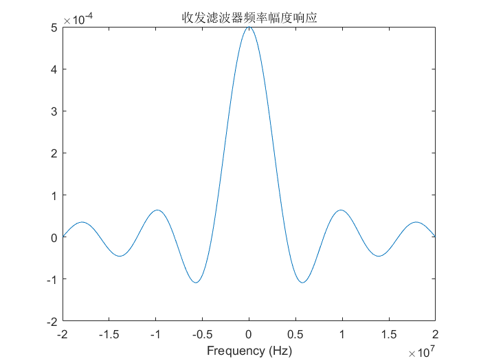
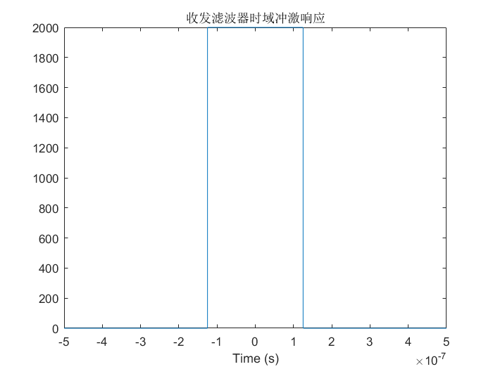
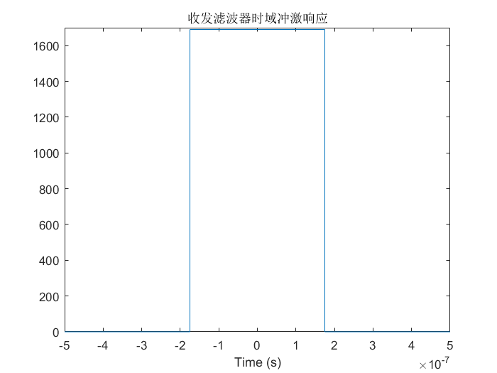
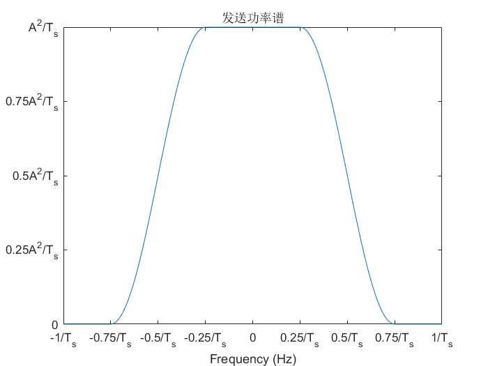
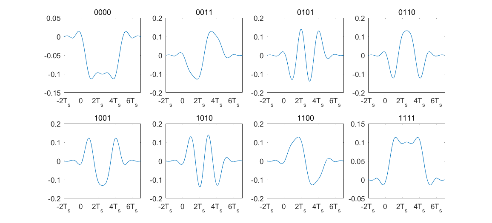
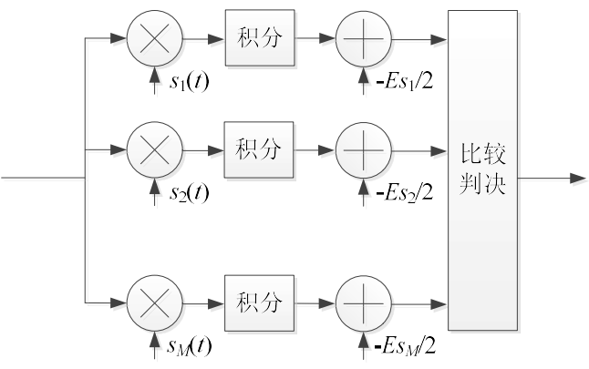

# 第七次课作业

> 无 76    RainEggplant    2017******

## 作业 1

### (1)

在第五次作业中，已求得 $g(t)$ 的频率响应为
$$
G(f) = \frac{5 \times 10^6}{\pi^2 f^2} \sin(0.2 \times 10^{-6} \pi f) \sin(0.3 \times 10^{-6}\pi f)
$$
作出其图像如下

以 $1/T_s$ 频率进行采样，频谱如下（请忽略幅值的绝对大小）

可见满足奈奎斯特第一准则。因此能找到无失真的采样点。

### (2)

匹配滤波接收时，收发滤波器应满足
$$
H_{收}(f)=k H^*_{发}(f)e^{-j 2 \pi f t_0}
$$
这就要求
$$
H_{收}(f) H_{发}(f) = k \lvert H_{发}(f) \rvert^2 e^{-j 2 \pi f t_0} = G(f)
$$
但由于 $G(f)$ 为实函数，且存在小于零的部分，故上式无解。从而无法设计出这样的匹配滤波器。

### (3)

此时
$$
G(f)=\frac{4 \times 10^6}{\pi^2 f^2} \sin ^2 (0.25 \times 10^{-6} \pi f)
$$
故可以设计收发滤波器
$$
\begin{align}
H_{收}(f) = H_{发}(f) = &\sqrt{G(f)} \\
= & \frac{2 \times 10^3}{\pi f} \sin (0.25 \times 10^{-6} \pi f)
\end{align}
$$
易得其时域响应
$$
h(t)= 2 \times 10^3 \times \mathrm{rect} \left( \frac{t}{0.25 \times 10^{-6}} \right)
$$
作图如下

### (4)

#### 对 $a_k$ 逐个判决

接收框图如下

其中，初级滤波是一个低通滤波器。

采用第五次作业中的技巧，用 $(1+j)/2$ 乘上接收到的 $\{ a_k\}$ , 得到 $\{ c_k\}$ 。则有 $c_k=b_{k-1}+jb_k$，实际上就是 16QAM。故其误码率
$$
P_{s,a} \approx \frac{4(L-1)}{L} Q\left(\sqrt{\frac{3}{L^2-1} \frac{E_s}{n_0}} \right)
$$
代入 $L=4$ 得误码率约为 
$$
P_{s,a}\approx 3 Q\left(\sqrt{\frac{1}{5} \frac{E_s}{n_0}} \right)
$$

#### 对 $b_k$ 逐个判决

接收框图如下

其中，初级滤波是一个低通滤波器。

其实部代表 $\{ b_{k-1}\}$, 虚部代表  $\{ b_k\}$ 。

实部、虚部的错误率相等，均为 $P_0= \frac{2(L-1)}{L} Q\left(\sqrt{\frac{3}{L^2-1} \frac{E_s}{n_0}} \right)$。

由于一个 $c_k$ 包含 $b_k$ 和 $b_{k-1}$ 两组消息比特，所以对任意一组消息比特 $b_i$, 仅当 $c_i$ 的虚部与 $c_{i+1}$ 的实部正确传输时，$b_i$ 被正确传输。故误码率为 $1-(1-P_0)^2 \approx 2P_0 = \frac{4(L-1)}{L} Q\left(\sqrt{\frac{3}{L^2-1} \frac{E_s}{n_0}} \right)$, 代入 $L=4$ 得误码率约为 
$$
P_{s,b}\approx 3 Q\left(\sqrt{\frac{1}{5} \frac{E_s}{n_0}} \right)
$$

#### 对信源逐比特判决

高信噪比下，认为符号只会错成相邻的符号。因为采用格雷映射，所以只错 1 比特。又因为发射 $n$ 个 $a_k$ 只能得到 $n$ 个 $b_k$, 即 $2n \text{ bit}$ 信息，故 $E_s = 2 E_b$。从而误比特率
$$
P_b=\frac{P_{s,b}}{\log_2 L}=\frac{3}{2} Q\left(\sqrt{\frac{2}{5} \frac{E_b}{n_0}} \right)
$$

### (5)

此时
$$
G(f)=\frac{2.857 \times 10^6}{\pi^2 f^2} \sin ^2 (0.35 \times 10^{-6} \pi f)
$$
故可以设计收发滤波器
$$
\begin{align}
H_{收}(f) = H_{发}(f) = &\sqrt{G(f)} \\
= & \frac{1.690 \times 10^3}{\pi f} \sin (0.35 \times 10^{-6} \pi f)
\end{align}
$$
易得其时域响应
$$
h(t)= 1.690 \times 10^3 \times \mathrm{rect} \left( \frac{t}{0.35 \times 10^{-6}} \right)
$$
作图如下

最佳采样点为 $t=0.35\mu \text{s} + n T_s$ 。

### (6)

此时符号间会产生串扰。

对于每个 $b_k$, 原本信号电平均方为 $S=2.5A^2$, 噪声方差为 $\sigma^2$。此时采样点的干扰强度方差
$$
I=\left(\frac{0.35-1/3}{0.35}\right)^2S=2.268\times 10^{-3} S
$$
因为 $\frac{S}{N}=\frac{E_s}{n_0}$, 故
$$
\frac{S}{N+I}=\frac{1}{\frac{n_0}{E_s}+2.268\times 10^{-3}}
$$
从而
$$
P_b=\frac{3}{2} Q\left(\sqrt{\frac{1}{5} \frac{1}{\frac{n_0}{E_s}+2.268\times 10^{-3}}} \right) = \frac{3}{2} Q\left(\sqrt{\frac{1}{5} \frac{1}{\frac{n_0}{2E_b}+2.268\times 10^{-3}}} \right)
$$

## 作业 2

### (1)

设发送波形
$$
s(t)= \sum _n a_n g(t-nT_s)
$$
假设原待传比特流 0 和 1 出现等概，则超级符号的比特流 0 和 1 出现也等概。故
$$
\mathbb{E}(a_n)=0
$$

$$
\mathrm{Cov}_{aa}(n) = \mathbb{E}(a_k a_{k-n}) = A^2 \delta(n)
$$

从而
$$
\begin{align}
\mathbb{S}(f) &= \frac{A^2}{T_s} \lvert G(f) \rvert ^2 \\
\end{align}
$$
其中
$$
\begin{align}
\lvert G(f) \rvert ^2=&
\begin{cases}
1 &, \lvert f \rvert \le \frac{1}{4 T_s} \\
\frac{1}{2} \left(1+ \cos \left( 2 \pi T_s \left[\lvert f \rvert-\frac{1}{4 T_s} \right] \right) \right) = \frac{1}{2} \left(1+ \sin \left( 2 \pi T_s \lvert f \rvert  \right) \right) & ,\frac{1}{4 T_s} \le \lvert f \rvert \le \frac{3}{4 T_s} \\
0 &, \lvert f \rvert \ge \frac{3}{4 T_s}
\end{cases}
\end{align}
$$
作出功率谱如图

由于每 4 个发送的二元符号只对应 3 个信息比特，其频谱效率为
$$
\frac{\frac{3}{4} R_s}{\frac{3}{4 T_s}} = 1 \text{ bps/Hz}
$$

### (2)

一个超级符号对应的比特流有如下 8 种，记作 $a_1 a_2 a_3 a_4$

<table>
  <tr>
    <th>比特流</th>
    <td>0000</td>
    <td>0011</td>
    <td>0101</td>
    <td>0110</td>
    <td>1001</td>
    <td>1010</td>
    <td>1100</td>
    <td>1111</td>
  </tr>
  <tr>
    <th>极性</th>
    <td>----</td>
    <td>--++</td>
    <td>-+-+</td>
    <td>-++-</td>
    <td>+--+</td>
    <td>+-+-</td>
    <td>++--</td>
    <td>++++</td>
  </tr>
</table>

则一个超级符号的波形为
$$
s(t)= \sum _{n=0} ^ 3 a_n g(t-nT_s)
$$
绘制如下

能量表达式为
$$
\begin{align}
E_{s超}=& \int_{-\infty}^{\infty} \left( \sum _{n=0} ^ 3 a_n g(t-nT_s)\right)^2 \mathrm{d}t
\end{align}
$$

### (3)

最佳接收机结构如下，其中 $M=8$。

### (4)

超级符号共有 8 种。我们认为每个超级符号的能量都大致为 $E_{s超}$，则超级符号 $s_i$ 和 $s_j$ 的相关系数
$$
\rho_{ij}=\frac{\int_{-\infty}^{\infty}s_i(t) s_j(t) \mathrm{d}t}{E_{s超}}
$$
则成对差错概率
$$
P_{ij}= Q \left(\sqrt{\frac{E_{s_i}+E_{s_j}-2 \rho_{ij} \sqrt{E_{s_i}E_{s_j}}}{2 n_0}} \right)
= Q \left(\sqrt{\frac{E_{s超}- \int_{-\infty}^{\infty}s_i(t) s_j(t) \mathrm{d}t}{n_0}} \right)
$$
从而误块率的上界
$$
\begin{align}
P_{blk} \le & \frac{1}{8} \sum_{i=1}^8 \left( \sum_{j \ne i} P_{ij}  \right) \\
=& \frac{1}{8} \sum_{i=1}^8 \left( \sum_{j \ne i} Q \left(\sqrt{\frac{E_{s超}- \int_{-\infty}^{\infty}s_i(t) s_j(t) \mathrm{d}t}{n_0}} \right) \right)
\end{align}
$$
因为每个超级符号对应 3 个信息比特，故 $E_{s超} = 3 E_b$, 从而
$$
P_{blk} \le \frac{1}{8} \sum_{i=1}^8 \left( \sum_{j \ne i} Q \left(\sqrt{\frac{3 E_b- \int_{-\infty}^{\infty}s_i(t) s_j(t) \mathrm{d}t}{n_0}} \right) \right)
$$

### (5)

因为 1 个超级符号由 4 个调制符号组成，针对每个调制符号的最佳接收即采用 $g(t)$ 的匹配滤波器进行滤波采样。故这样判决仍然不失其最佳特性。

### (6)

多个超级符号连续传输的波形表达式为
$$
s(t)=\sum_{n} \sum_{l=0}^3 a_{nl} g(t-(4n+l)T_s)
$$
因为
$$
\begin{align}
\int_{-\infty}^{\infty} g(t) g(t-nT_s) \mathrm{d}t =& \int_{-\infty}^{\infty} g(t) g(t-nT_s) \mathrm{d}t \\
= & \mathcal{F}[g(t)g(t-nT_s)]|_{f=0} \\
= & \frac{1}{2 \pi} G(f) * \left(G(f) e^{-j 2 \pi f n T_s} \right) |_{f=0} \\
= & \frac{1}{2 \pi} \int_{-\infty}^{\infty} G(-\tau)G(\tau) e^{-j 2 \pi \tau n T_s} \mathrm{d} \tau \\
= & \frac{1}{2 \pi} \int_{-\infty}^{\infty} \lvert G(\tau) \rvert ^2 e^{-j 2 \pi \tau n T_s} \mathrm{d} \tau \\
= & f^*(nT_s)
\end{align}
$$
其中，
$$
f(t)=
\begin{cases}
0 & t = \pm T_s \\
\frac{1}{T_s} \mathrm{sinc}(\frac{t}{T_s}) \frac{\cos(\frac{\pi t}{2T_s})}{1-(\frac{t}{T_s})^2} & \text{otherwise}
\end{cases}
$$
当 $n \ne 0$ 时有 $f(t)=0$, 从而证明对于不同的 $l$, $g(t-lT_s)$ 之间是正交的。因此在对第 $n$ 个超级符号进行最佳接收时，不会受到来自其它超级符号波形的影响。

### (7)

接收框图如下

其中，初级滤波是一个低通滤波器，匹配滤波器是 $g(t)$ 的匹配滤波器。