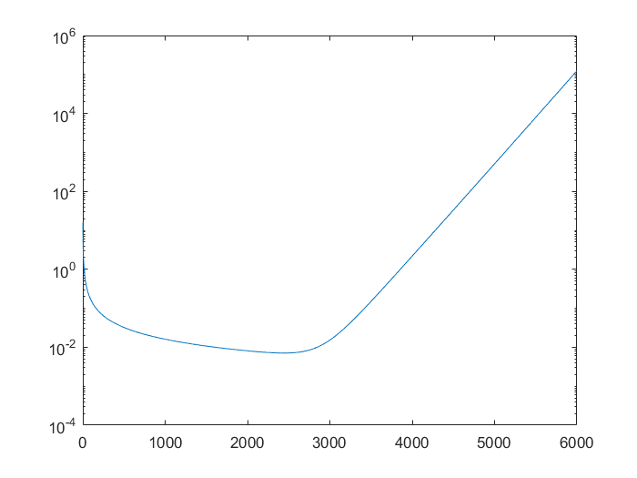

# 第二次课作业

> 无 76    RainEggplant    2017******

## 1.

采用直径为 $D$ 的抛物面天线，则增益
$$
G=\frac{4 \pi}{\lambda ^2}A=\frac{4 \pi}{\lambda ^2} \cdot \frac{\pi D^2}{4}=(\frac{\pi D}{\lambda})^2
$$
因为载波频率 $f_c=1$ GHz, 所以波长 $\lambda _c=0.3$ m。

取采集器、传感器天线直径 $D_采=D_传=0.6$ m, 则其增益 $G_T=G_R=4 \pi ^2$。

记损耗因子 $m=(\dfrac{\lambda}{4 \pi d})^2$, 则当 $d=10$ m 时，$m=5.70\times 10^{-6}$。

取 $T_1=2999$ ms, $T_2=1$ ms, 则传输速率
$$
R=\frac{3 \rm{kB}}{1 \rm{ms}}=\frac{3 \times 1024 \times 8 \rm{bit}}{1 \rm{ms}}=24576000 \ \rm{bit/sec}
$$
我们不妨设定目标信道容量为 $C=2.5 \times 10^7$ bit/sec, 则根据 AWGN 信道容量公式 $C=W \mathrm{log}_2(1+SNR)$, 在 $W=B=1$ MHz 时，信噪比 $SNR=2^{25}-1$。

由于前一级还有一个噪声系数为 2 dB 的放大器，故采集器接收到的信号的信噪比 $SNR_0=SNR \cdot 10^{\frac{2}{10}}=5.318\times 10^7$。

因为噪声功率 $N=kTB=4.144\times 10^{-15}$ W, 所以采集器接收到的信号功率为 $S=N \cdot SNR_0=2.204\times 10^{-7}$ W。

因为 $S=P_2 G_T G_R m$, 故算出传感器的发射功率 $P_2=2.481\times 10^{-5}$ W。

因此，在 $T_2$ 阶段，传感节点使用的总能量 $E=(P_2+P_0)T_2=1.$025 mJ。

又因为 $T_1$ 阶段，传感节点接收并转换的有效功率 $P_R = P_1 G_T G_R m \eta_1$, $P_R T_1 = E$, 故 $P_1 = 5.495 \times 10^{-5} \rm{W} = 54.95 \mu W$。 


## 2.

当采集器与传感器距离 100 m 时，天线直径不变。

为了求最小的 $P_1$, 我们假设信道容量 $C=R$。在此条件下，按照前一问的思路编写如下 MATLAB 程序（`solution.m`）：

```matlab
lambda = 0.3; % 载波波长
B = 1e6; % 带宽
k = 1.38064852e-23; % 玻尔兹曼常数
T = 27+273.15; % 温度
P0 = 1e-3;
eta = 0.7;

d = 100; % 距离
D_T = 0.6; % 采集器天线直径
D_R = 0.6; % 传感器天线直径

G_T = (pi*D_T/lambda)^2; % 增益
G_R = (pi*D_R/lambda)^2;
m = (lambda/(4*pi*d))^2; % 损耗因子
N = k*T*B; % 噪声功率

T_ratio = [1:6000]'; % T1, T2 之比
R = 1024*8*(1+T_ratio); % 传输速率
SNR = 2.^(R/B)-1; % 信道容量等于传输速率时的信噪比
SNR0 = SNR.*10^0.2; % 采集器接收到的信号的信噪比
S = N*SNR0; % 采集器接收到的信号功率
P2 = S/(G_T*G_R*m); % 传感器的发射功率
P1 = (P0+P2)./(T_ratio*G_T*G_R*m*eta); % 采集器的发射功率

figure;
semilogy(T_ratio, P1);
```


得到如下结果：



读出当 $T_1:T_2 \approx 2441$ 时，$P_{1,min}=7.10$ mW。