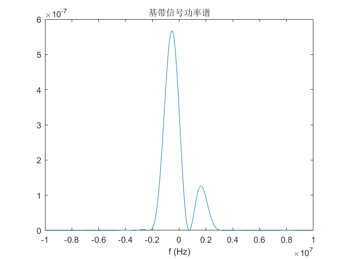
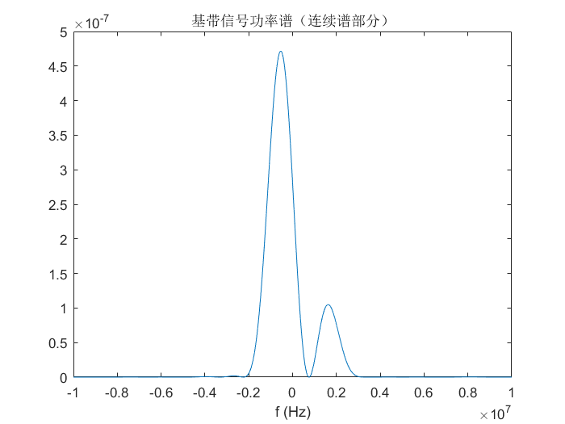
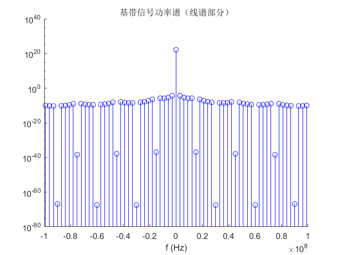

# 第五次课作业

> 无 76    RainEggplant    2017******

（相关 MATLAB 代码已一并打包）

## 作业 1

### (1)

由题意，四元实电平符号 $\{b_k\}$ 与消息比特流的映射如下：

| 比特流 | 00    | 01    | 11   | 10   |
| ------ | ----- | ----- | ---- | ---- |
| 电平   | -1.5A | -0.5A | 0.5A | 1.5A |

因为 $a_k=(1+j)b_k+(1-j)b_{k-1}$, 故 $a_k$ 取值共有 16 种可能。作出 $\{a_k\}$ 的星座图如下（横纵轴单位为 A）：

### (2)

接收时，用 $(1+j)/2$ 乘上接收到的 $\{ a_k\}$ , 得到 $\{ c_k\}$ 。则有 $c_k=b_{k-1}+jb_k$。

由于 $\{b_k\}$ 出现等概，容易验证 $\{ c_k\}$ 出现也等概。画出 $\{ c_k\}$ 的星座图以及判决区间如下（横纵轴单位为 A）：

### (3)

 $\{ c_k\}$ 实际上就是 16QAM，其实部代表 $\{ b_{k-1}\}$, 虚部代表  $\{ b_k\}$ 。

实部、虚部的错误率相等，均为 $P_0= \frac{2(L-1)}{L} Q\left(\sqrt{\frac{3}{L^2-1} SNR_{复}} \right)$。

由于一个 $c_k$ 包含 $b_k$ 和 $b_{k-1}$ 两组消息比特，所以对任意一组消息比特 $b_i$, 仅当 $c_i$ 的虚部与 $c_{i+1}$ 的实部正确传输时，$b_i$ 被正确传输。故误组率为 $1-(1-P_0)^2 \approx 2P_0 = \frac{4(L-1)}{L} Q\left(\sqrt{\frac{3}{L^2-1} SNR_{复}} \right)$, 代入 $L=4$ 得误组率约为 
$$
P_e\approx 3 Q\left(\sqrt{\frac{1}{5} SNR_{复}} \right)
$$

### (4)

高信噪比下，认为符号只会错成相邻的符号。因为采用格雷映射，所以只错 1 比特。从而误比特率
$$
P_b=\frac{P_e}{\log_2 L}=\frac{3}{2} Q\left(\sqrt{\frac{1}{5} SNR_{复}} \right)
$$

### (5)

此时，00 和 01 的判决门限无需变动，而 01、10 与 11 间的判决门限需要改变。以 01 和 11 的判决门限为例，求解
$$
0.2 \times \frac{1}{\sqrt{2\pi} \sigma} \exp \left(-\frac{(x+0.5A)^2}{2\sigma}  \right) = 0.4 \times \frac{1}{\sqrt{2\pi} \sigma} \exp \left(-\frac{(x-0.5A)^2}{2\sigma}  \right)
$$
得 $x=-\ln 2 \times \frac{\sigma}{A} \approx -0.6931 \frac{\sigma}{A}$，这即为 01 和 11 的判决门限。

同理，可求得 10 和 11 的判决门限为 $(A+0.6931\frac{\sigma}{A})$。

一种典型的判决区间如下图（$A=1, \sigma=0.25$）：

## 作业 2

### (1)

基带复信号
$$
\begin{align}
s_B(t) &= \sum _n a_n g(t-nT_s) \\
&= \sum _n \left[ (1+j) b_n + (1-j) b_{n-1} \right] g(t-nT_s) \\
&= \frac{\sqrt{2}}{2} e^{-j \frac{\pi}{4}} \sum_n (b_{n-1} + j b_n)g(t-nT_s) \\
&= \frac{\sqrt{2}}{2} e^{-j \frac{\pi}{4}} \sum_n c_ng(t-nT_s)
\end{align}
$$
因为 $c_n = b_{n-1}+j b_n$, 所以 $\mathbb E(c_n)=0$。从而
$$
\begin{align}
\mathrm{Cov}_{cc}(n) &=\mathbb{E}(c_kc_{k-n}^*) \\
&= \mathbb{E}[(b_{k-1}+jb_k)(b_{k-n-1} - b_{k-n})] \\
&= \mathbb{E}[(b_{k-1}b_{k-n-1}+b_k b_{k-n}) + j(b_k b_{k-n-1} - b_{k-1} b_{k-n})] \\
&=
\begin{cases}
\mathbb{E}(b_{k-1}^2+b_{k}^2) &=2.5A^2 & ,n=0 \\
-j \mathbb{E}(b_{k-1}^2) &= -j1.25A^2 & ,n=1 \\
j \mathbb{E}(b_{k-1}^2) &= j1.25A^2 & ,n=-1 \\
0 & & \mbox{, otherwise}
\end{cases}

\end{align}
$$
故
$$
\begin{align}
\mathbb{S}_B(f) &= \frac{1}{2} \left\{ \frac{1}{T_s} \lvert G(f) \rvert ^2 [2.5 A^2 +j1.25A^2(e^{j2 \pi f T_s}-e^{j2 \pi f T_s})] \right\} \\
&= \frac{5A^2}{4T_s} \lvert G(f) \rvert ^2 (1-\sin(2 \pi f T_s))
\end{align}
$$
易求得 $g(t)$ 的频谱为
$$
\lvert G(f) \rvert = \frac{5\times 10^6}{\pi^2 f^2} \sin(0.2 \times 10^{-6} \pi f) \sin(0.3 \times 10^{-6}\pi f)
$$
故
$$
\mathbb{S}_B(f)=\frac{125 \times 10^{12} A^2}{4 T_s \pi^4 f^4} (1-\sin(2 \pi f T_s)) [ \sin(0.2 \times 10^{-6} \pi f) \sin(0.3 \times 10^{-6} \pi f)]^2
$$
作出基带信号的功率谱如下图

载波功率为 1 W 时，有 $s(t) = \Re [s_B(t)e^{j2\pi f_c t}]$。此时载波波形的功率谱为
$$
\mathbb{S}(f) = \frac{\mathbb{S}_B(f-f_c)+\mathbb{S}_B(-f-f_c)}{4}
$$
功率谱图不再单独画出。

### (2)

此时，$\mathbb{E}(b_n)=0.1A$。因为 $c_n = b_{n-1}+j b_n$, 所以 $\mathbb E(c_n)=0.1A+j0.1A$。从而
$$
\begin{align}
\mathrm{Cov}_{cc}(n) &=\mathbb{E}(c_k c_{k-n}^*) - \mathbb E(c_k) \mathbb E(c_{k-n})^* \\
&= \mathbb{E}[(b_{k-1}b_{k-n-1}+b_k b_{k-n}) + j(b_k b_{k-n-1} - b_{k-1} b_{k-n})] - 0.02A^2\\
&=
\begin{cases}
\mathbb{E}(b_{k-1}^2+b_{k}^2) &=2.08A^2 & ,n=0 \\
\mathbb{E}(b_{k-1} b_{k-2}+b_k b_{k-1}) +j \mathbb{E}(b_k b_{k-2} -b_{k-1}^2) &= - j 1.04A^2 & ,n=1 \\
\mathbb{E}(b_{k-1} b_{k}+b_k b_{k+1}) +j \mathbb{E}(b_k^2 -b_{k-1}b_{k+1}) &= j 1.04A^2 & ,n=-1 \\
0 & & \mbox{, otherwise}
\end{cases}
\end{align}
$$
故
$$
\begin{align}
\mathbb{S}_B(f) &= \frac{1}{2} \left\{ \frac{1}{T_s} \lvert G(f) \rvert ^2 [2.08 A^2 +j1.04A^2(e^{j2 \pi f T_s}-e^{j2 \pi f T_s})] \right\} + 0.02 \frac{A^2}{T_s^2} \sum_{k=-\infty}^{\infty} \lvert G(f) \rvert ^2 \delta(f-\frac{k}{T_s}) \\
&= 1.04\frac{A^2}{T_s} \lvert G(f) \rvert ^2 (1-\sin(2 \pi f T_s)) + 0.02\frac{A^2}{T_s^2} \sum_{k=-\infty}^{\infty} \lvert G(f) \rvert ^2 \delta(f-\frac{k}{T_s}) \\
&= \frac{1\times 10^{12} A^2}{T_s \pi^4 f^4} [ \sin(0.2 \times 10^{-6} \pi f) \sin(0.3 \times 10^{-6} \pi f)]^2 \left\{26 (1-\sin(2 \pi f T_s))+0.5 \frac{1}{T_s} \delta(f-\frac{k}{T_s}) \right\} \\
\end{align}
$$
作出基带信号的功率谱如下图

载波功率为 1 W 时，有 $s(t) = \Re [s_B(t)e^{j2\pi f_c t}]$。此时载波波形的功率谱为
$$
\mathbb{S}(f) = \frac{\mathbb{S}_B(f-f_c)+\mathbb{S}_B(-f-f_c)}{4}
$$
功率谱图不再单独画出。

### (3)

基带复信号
$$
\begin{align}
s_B(t) &= \sum _n a_n g(t-nT_s) \\
\end{align}
$$
因为 $a_n = (1+j)(b_{n-1}+b_n)$, 所以 $\mathbb E(a_n)=0$。从而
$$
\begin{align}
\mathrm{Cov}_{aa}(n) &=\mathbb{E}(a_k a_{k-n}^*) \\
&= \mathbb{E}[(1+j)(b_{k-1} + b_k)(1-j)(b_{k-n-1} + b_{k-n})] \\
&= 2 \mathbb{E}[b_{k-1} b_{k-n-1} + b_k b_{k-n} + b_k b_{k-n-1} + b_{k-1} b_{k-n}] \\
&=
\begin{cases}
\mathbb{E}(b_{k-1}^2+b_{k}^2) &=5A^2 & ,n=0 \\
\mathbb{E}(b_{k-1}^2) &= 2.5A^2 & ,n=1 \\
\mathbb{E}(b_{k-1}^2) &= 2.5A^2 & ,n=-1 \\
0 & & \mbox{, otherwise}
\end{cases}
\end{align}
$$
故
$$
\begin{align}
\mathbb{S}_B(f) &= \frac{1}{2} \left\{ \frac{1}{T_s} \lvert G(f) \rvert ^2 [5 A^2 +2.5A^2(e^{j2 \pi f T_s}+e^{j2 \pi f T_s})] \right\} \\
&= \frac{5A^2}{2T_s} \lvert G(f) \rvert ^2 (1+\cos(2 \pi f T_s)) \\
&= \frac{125 \times 10^{12} A^2}{2 T_s \pi^4 f^4} (1+\cos(2 \pi f T_s)) [ \sin(0.2 \times 10^{-6} \pi f) \sin(0.3 \times 10^{-6} \pi f)]^2
\end{align}
$$
作出基带信号的功率谱如下图

载波功率为 1 W 时，有 $s(t) = \Re [s_B(t)e^{j2\pi f_c t}]$。此时载波波形的功率谱为
$$
\mathbb{S}(f) = \frac{\mathbb{S}_B(f-f_c)+\mathbb{S}_B(-f-f_c)}{4}
$$
功率谱图不再单独画出。

