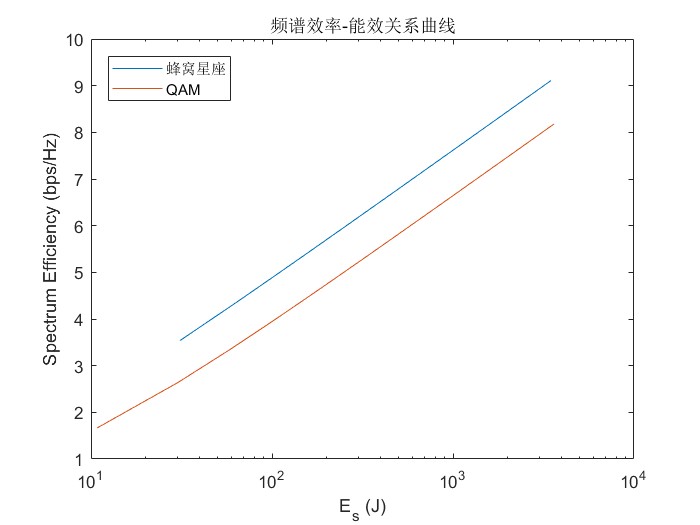
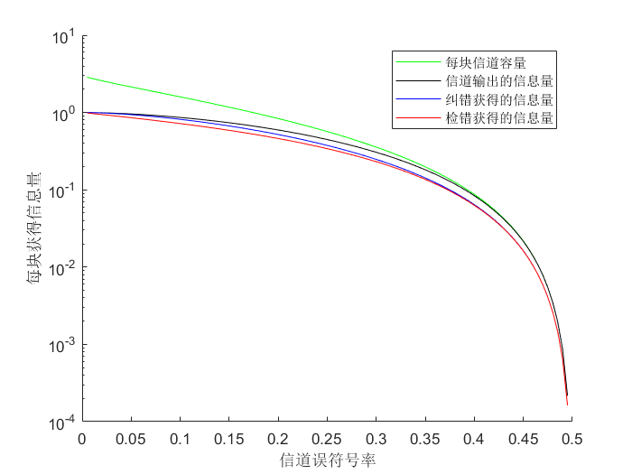

# 第八次课作业

> 无 76    RainEggplant    2017******

（相关 MATLAB 代码已一并打包）

## 作业 1

### (1)

$k=3$ 时，每发送 1 个符号可以传送 $R_M = \log_2 (3 \times 3^2+3\times 3 + 1)=5.2095$ bit 信息。

采用滚降系数 $\alpha=0.2$ 的根号升余弦滤波器，则符号率 $R_s$ 与基带单边带宽 $B$ 的关系为
$$
R_s = \frac{2}{1+\alpha} B = \frac{5}{3} B
$$
故载波传输的比特频谱效率
$$
\frac{R_b}{W}=\frac{R_s R_M}{2B} \approx 4.3412 \text{ bps/s}
$$

### (2)

总（单边）带宽
$$
W=\frac{10 \mathrm{M}}{4.3412}=2.3035 \text{ MHz}
$$
因为对于根号升余弦滤波器来说，当 $\frac{1-\alpha}{2T_s} \le \lvert f \rvert \le \frac{1+\alpha}{2T_s}$ 时，有
$$
\lvert G(f) \rvert ^2=\frac{1}{2} \left(1+ \cos \left( \frac{\pi T_s}{\alpha} \left[\lvert f \rvert-\frac{1-\alpha}{2 T_s} \right] \right) \right)
$$
令 $\lvert G(f) \rvert ^2 = 0.5$, 解得 $f=\pm \frac{1}{2 T_s}$, 故 3dB 带宽 $W_{3 \text{dB}}=\frac{1}{T_s}$。易得 $R_s = \frac{10 \text{M}}{R_M}=1.9196 \text{ MBaud}$，从而
$$
W_{3 \text{dB}} = 1.9196 \text{ MHz}
$$

### (3)

最优接收机框图如下：

其中，初级滤波是一个带通滤波器。匹配滤波器也是一个根号升余弦滤波器。如果成形滤波器的冲激响应为 $g(t)$, 则该匹配滤波器的冲激响应 $h(t)=a \cdot g^*(T_s-t)$, 下一级在 $t=nT$ 时进行采样判决。

### (4)

设发射的每符号能量为 $E_s$, 则使用最佳接受机时，采样判决处的信噪比（实）为
$$
SNR_{实}=\frac{2E_s h^2}{n_0}
$$
由第四次作业，推导知误符号率与信噪比的关系为
$$
\begin{align}
P_s &= \frac{18k^2+6k}{3k^2+3k+1} Q \left( \sqrt{\frac{4(3k^2+3k+1)}{k(k+1)(5k^2+5k+2)}\cdot SNR_复} \right)
\end{align}
$$
故误符号率为
$$
\begin{align}
P_s &= \frac{18k^2+6k}{3k^2+3k+1} Q \left( \sqrt{\frac{4(3k^2+3k+1)}{k(k+1)(5k^2+5k+2)}\cdot \frac{E_s h^2}{n_0}} \right)
\end{align}
$$

### (5) & (6)

对于 MQAM ($M=L^2$), 其误符号率
$$
P_{s, \text{QAM}}= 4\frac{L-1}{L} Q \left(\sqrt{\frac{3}{L^2-1}\cdot \frac{E_s h^2}{n_0}}  \right)
$$
画出二者的频谱效率-能效曲线如下：

## 作业 2

### (1)

不是系统码。因为编码序列不直接包含原信息序列。

### (2)

需要对 $\mathbf{G}$ 做初等行变换，得到系统码的生成矩阵
$$
\begin {align}
\mathbf{G}_{系统码} 
& =
\left[
\begin{matrix}
	1 & 1 & 1 \\
	0 & 1 & 1 \\
	0 & 0 & 1
\end{matrix}
\right]
\left[
\begin{matrix}
	1 & 1 & 0 & 1 & 0 & 0 & 1 \\
	0 & 1 & 1 & 0 & 1 & 0 & 1 \\
	0 & 0 & 1 & 1 & 0 & 1 & 1
\end{matrix}
\right] \\
& =
\left[
\begin{matrix}
	1 & 0 & 0 & 0 & 1 & 1 & 1 \\
	0 & 1 & 0 & 0 & 1 & 1 & 0 \\
	0 & 0 & 1 & 1 & 0 & 1 & 1
\end{matrix}
\right]
\end{align}
$$

### (3)

经过本题编码后，3 个信息比特对应 7 个调制比特。再经第七次作业 3 中编码后，3 个信息比特对应 $\frac{28}{3}$ 个调制比特。从而 $E_{s超}=\frac{9}{7} E_b$, 从而
$$
P_e \le \frac{1}{8} \sum_{i=1}^8 \left( \sum_{j \ne i} Q \left(\sqrt{\frac{\frac{9}{7} E_b- \int_{-\infty}^{\infty}s_i(t) s_j(t) \mathrm{d}t}{n_0}} \right) \right)
$$

## 作业 3

### 信道容量

设信道误符号率为 $p$, 发送符号为 $S$, 接收符号为 $R$。容易知道发送等概时 $I(S;R)$ 取最大值，即为信道容量。则
$$
P(R=0)=\frac{1}{2}p+\frac{1}{2}(1-p)=\frac{1}{2}
$$

$$
P(R=1)=\frac{1}{2}(1-p)+\frac{1}{2}p=\frac{1}{2}
$$

从而
$$
H(R)=1 \text{ bit}
$$
又因为
$$
\begin{align}
H(R|S) &=\frac{1}{2}[-(1-p) \log_2 (1-p) - p \log_2 p] \times 2 \\
&= -(1-p) \log_2 (1-p) - p \log_2 p
\end{align}
$$
故信道容量
$$
\begin{align}
C&=\max \{I(S;R)\}= H(R)-H(R|S) \\
&= 1 + (1-p) \log_2 (1-p) + p \log_2 p
\end{align}
$$
故 3 次重复码的每块信道容量
$$
C_3 = 3C = 3( 1 + (1-p) \log_2 (1-p) + p \log_2 p)
$$

### 信道输出的信息量

设发送的 3 次重复码为 $X$, 信道输出为 $Y$。信道一共可能输出 000, 001, 010, 100, 011, 101, 110, 111 共 8 种结果。其中

- 000, 111 单个出现的概率：$\frac{1}{2}[(1-p)^3+p^3]=\frac{3p^2-3p+1}{2}$
- 001, 010, 100, 011, 101, 110 单个出现的概率：$\frac{1}{2}[(1-p)^2 p + p^2(1-p)]=\frac{(1-p)p}{2}$

故
$$
\begin{align}
H(Y) &= -2 \times \frac{3p^2-3p+1}{2} \log_2 \left( \frac{3p^2-3p+1}{2} \right) - 6 \times \frac{(1-p)p}{2}\log_2 \left( \frac{(1-p)p}{2} \right) \\
&= -(3p^2-3p+1) \log_2 \left( \frac{3p^2-3p+1}{2} \right) - 3(1-p)p \log_2 \left( \frac{(1-p)p}{2} \right)
\end{align}
$$
而
$$
\begin{align}
H(Y|X) 
&= \frac{1}{2}\left\{-(1-p)^3 \log_2 (1-p)^3 - p^3 \log_2 (p^3) - C_3^1 (1-p)^2 p \log_2((1-p)^2 p) - C_3^2 (1-p) p^2 \right\} \times 2 \\
&= -(1-p)^3 \log_2 (1-p)^3 - p^3 \log_2 (p^3) - 3 (1-p)^2 p \log_2((1-p)^2 p) - 3 (1-p) p^2 \log_2((1-p) p^2)
\end{align}
$$
故信道输出的信息量
$$
\begin{split}
I_{out}&=&H(Y)-H(Y|X) \\
&=&-(3p^2-3p+1) \log_2 \left( \frac{3p^2-3p+1}{2} \right) - 3(1-p)p \log_2 \left( \frac{(1-p)p}{2} \right) \\
& & +(1-p)^3 \log_2 (1-p)^3 + p^3 \log_2 (p^3) + 3 (1-p)^2 p \log_2((1-p)^2 p) + 3 (1-p)p^2 \log_2((1-p) p^2)
\end{split}
$$

### 纠错获得的信息量

设 $Y$ 经过纠错得到 $Z$。由对称性易知 $P(Z=0)=P(Z=1)=\frac{1}{2}$, 从而 $H(Z)=1 \text{ bit}$。

3 次重复码中如果错误符号不超过 1 个，则能正确接收。因此，
$$
\begin{align}
H(Z|X) &=\frac{1}{2}\left\{-[(1-p)^3+C_3^2 p(1-p)^2)] \log_2 [(1-p)^3+C_3^2 p(1-p)^2)] - [p^3+C_3^2p^2(1-p)] \log_2 [p^3+C_3^2p^2(1-p)] \right\} \times 2 \\
&= -[(1-p)^2(1+2p)] \log_2 [(1-p)^2(1+2p)] - [p^2(3-2p)] \log_2 [p^2(3-2p)]
\end{align}
$$
纠错获得的信息量
$$
\begin{align}
I_{纠错}&=H(Z)-H(Z|X) \\
&=1 + [(1-p)^2(1+2p)] \log_2 [(1-p)^2(1+2p)] + [p^2(3-2p)] \log_2 [p^2(3-2p)]
\end{align}
$$

### 检错获得的信息量

设 $Y$ 经过检错得到 $M$。则
$$
P(M=0)=\frac{1}{2} (1-p)^3 + \frac{1}{2} p^3 = \frac{3p^2-3p+1}{2}
$$

$$
P(M=1)=\frac{1}{2} (1-p)^3 + \frac{1}{2} p^3 = \frac{3p^2-3p+1}{2}
$$

$$
P(M=E)=1-P(M=0)-P(M=1)=3p-3p^2
$$

从而
$$
\begin{align}
H(M) &= -(3p^2-3p+1) \log_2 \left( \frac{3p^2-3p+1}{2} \right) - (3p-3p^2) \log_2(3p-3p^2)
\end{align}
$$
而
$$
\begin{align}
H(M|X) &=\frac{1}{2}\left\{-(1-p)^3 \log_2 (1-p)^3 - p^3 \log_2 (p^3) - (3p-3p^2) \log_2(3p-3p^2) \right\} \times 2 \\
&= -(1-p)^3 \log_2 (1-p)^3 - p^3 \log_2 (p^3) - (3p-3p^2) \log_2(3p-3p^2)
\end{align}
$$
故检错获得的信息量
$$
\begin{align}
I_{检错}&=H(M)-H(M|X) \\
&=-(3p^2-3p+1) \log_2 \left( \frac{3p^2-3p+1}{2} \right) +(1-p)^3 \log_2 (1-p)^3 + p^3 \log_2 (p^3)
\end{align}
$$

### 作出图像

根据以上公式，作出信息量与信道误码率的图像

### 渐进性能分析

信道误符号率趋于 0 时，纠错和检错方式获得的信息量接近，都逼近信道输出的信息量。误符号率趋于 0.5 时，纠错与检错获得的信息量也相近，并且逼近信道容量。  

