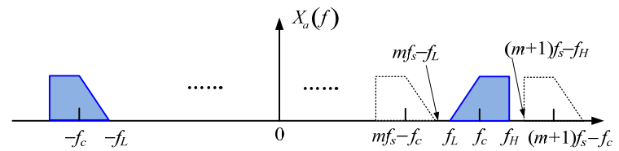
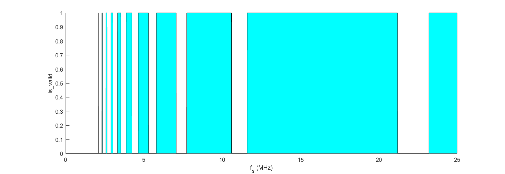
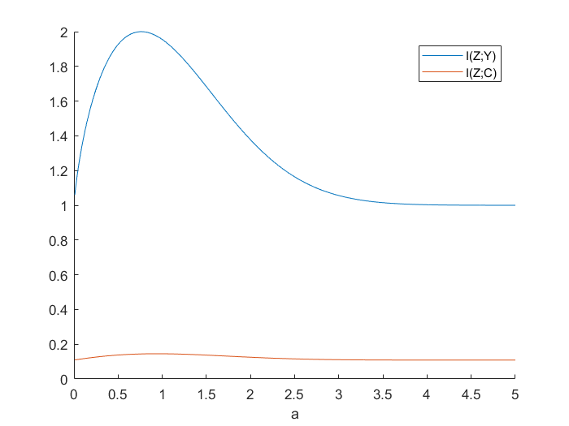
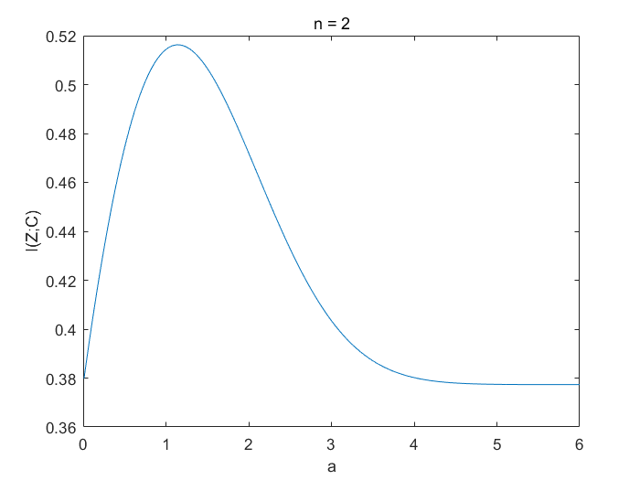
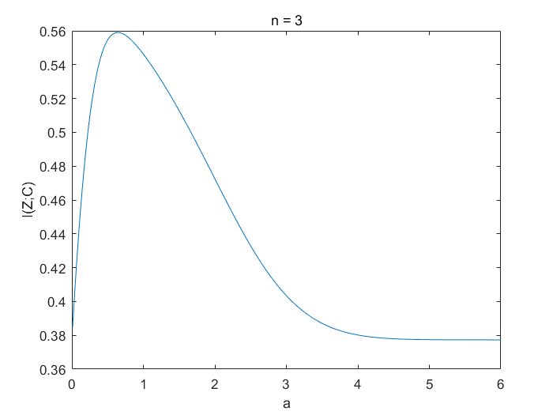
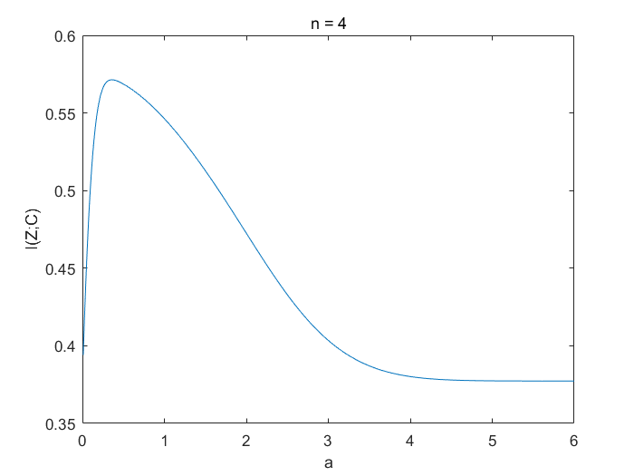
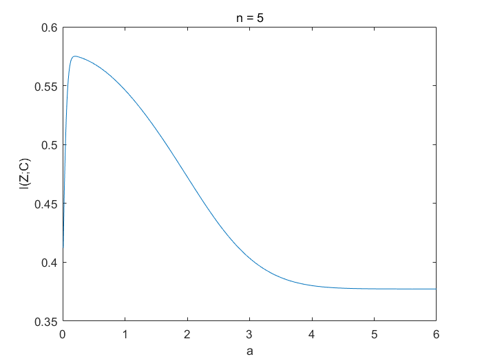
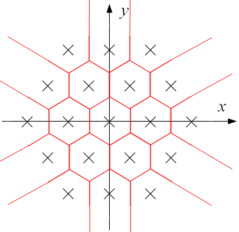
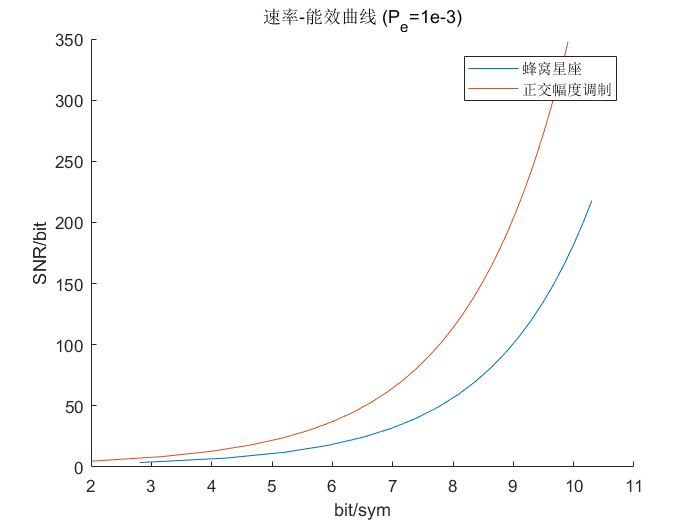

# 第四次课作业

## 作业 1

> 某实信号，其频率中心频率在 11.1 MHz，带宽为 1 MHz
>
> - 推导，并画出在 [0，25] MHz 范围内，可实现理想重构的采样率（可实现的为 1，不可实现的为 0）。 

设采样率为 $f_s$, 则经过采样后，信号的频谱会以 $f_s$ 为周期延拓。要能实现理想重构，则频谱不能发生混叠，即如下图：

因此，得出频谱不混叠的条件为：
$$
f_L \ge m f_s-f_L \\
f_H \le (m+1) f_s-f_H
$$
即
$$
\frac{2f_H}{m+1} \le f_s \le \frac{2f_L}{m}
$$
本题中，$f_L=f_c-B/2=10.6$ MHz, $f_H=f_c+B/2=11.6$ MHz。因此
$$
\frac{23.2}{m+1} \le f_s \le \frac{21.2}{m}
$$
其中 $m$ 取 $[0,\frac{f_L}{B}]$ 内的所有整数，即 0~10。

MATLAB 代码见 `q1.m`, 画出图形如下：

> 某带通信号，如果给定其可行的抽样频率为 3.5 倍带宽，能否估计出信号的最高截止频率？ 

根据上一问推导的公式，此时应有
$$
\frac{2f_H}{m+1} \le 3.5B \le \frac{2(f_H-B)}{m}
$$
所以应有
$$
\frac{3.5m+2}{2} B \le f_H \le \frac{3.5m+3.5}{2}B
$$
其中 $m$ 为非负整数。

---

## 作业 2

> 给出 $A=\sigma = a = 1$, $M=n=2$时，$E(z-y)^2$ 最小的重建电平。求此时的 $I(Z;Y)$ 和 $I(Z;C)$ 。 

此时 $f_X(x)=\frac{1}{2} (\delta(x+0.5)+\delta(x-0.5))$, $N \sim N(0,1)$。因为 $Y=X+N$, 所以
$$
\begin{align}
f_Y(y) & =f_X(y)*f_N(y) \\
& =\frac{1}{2}(\frac{1}{\sqrt{2 \pi}}\mathrm{exp}(-\frac{(y+0.5)^2}{2})+\frac{1}{\sqrt{2 \pi}}\mathrm{exp}(-\frac{(y-0.5)^2}{2})) \\
& = \frac{1}{2\sqrt{2 \pi}}(\mathrm{exp}(-\frac{(y+0.5)^2}{2})+\mathrm{exp}(-\frac{(y-0.5)^2}{2}))
\end{align}
$$
因为分层区间 $(y_k,y_{k+1}],\ k=1 \sim 4$ 为 $(-\infty,-1],\ (-1,0],\ (0,1],\ (1,+\infty)$。 故要使量化噪声最小，对应的 4 个重建电平 $z_1 \sim z_4$ 应满足：
$$
z_k=\frac{\int_{y_k}^{y_{k+1}}yf_y(y) \mathrm{dy}}{\int_{y_k}^{y_{k+1}}f_y(y) \mathrm{dy}}
$$
从而得到 $z_1=-1.6051$,  $z_2=-0.4693$,  $z_3=0.4693$,  $z_4=1.6051$。 

因为 $I(Z;Y)=H(Z)-H(Z|Y)$, 而 $z$ 取四个重建电平的概率分别为：0.1877, 0.3123, 0.3123, 0.1877, 故可得 $H(Z)=1.9547$ bit。又因为给定 $Y$ 就能确定 $Z$, 因此 $H(Z|Y)=0$。从而 $I(Z;Y)=1.9547$ bit。

因为 $P(Z=z_k|X)=P(Y \in (y_k,y_{k+1}]|X)=\int_{y_k}^{y_{k+1}} f_{Y|X}(y|x) \mathrm{dy}$, 而 $Y|X \sim N(X,1)$, 所以可由 $H(Z|X)=-\sum_x f_X(x) \sum_z P(z|x) \mathrm{log_2}(P(z|x))$ 算出条件熵 $H(Z|X)=1.8097$ bit。因此 $I(Z;C)=I(Z;X)=H(Z)-H(Z|X)=0.1450$ bit。

本题代码见文件 `q2/q2_1.m`。

> 令 $A=s=1$, $M=n=2$ 时，分别求使 $I(Z;Y)$ 和 $I(Z;C)$ 最大的 $a$ 

计算 $I(Z;Y)$ 和 $I(Z;C)$ 的思路一致，编写 MATLAB 代码求解（`q2/q2_2.m`）。

结果如下：

$a = 0.76, I(Z;Y)_{max} = 2$ bit。$a = 0.94, I(Z;C)_{max} = 0.145$ bit。

> 令 $A=s=1$, $M=4$ 时，分别求 $n=2、3、4、5$ 时可以得到的最大的 $I(Z;C)$ 及相应的 $a$ 

编写 MATLAB 代码求解（`q2/q2_3.m`）。

**n = 2 时：**

$a = 1.14, I(Z;C)_{max} = 0.516$ bit。

**n = 3 时：**

$a = 0.65, I(Z;C)_{max} = 0.559$ bit。

**n = 4 时：**

$a = 0.36, I(Z;C)_{max} = 0.571$ bit。

**n = 5 时：**

$a = 0.20, I(Z;C)_{max} = 0.575$ bit。

---

## 作业 3

#### 1.

因为 $n$ 圈蜂窝星座 1 个符号有 $1+\sum_{i=1}^n 6i = 3n^2+3n+1$ 种电平取值，故每符号可传送 $\mathrm{log}_2 (3n^2+3n+1)$ bit 信息。

#### 2.

最佳判决区域边界如下：

#### 3.

设复信号电平最小间距为 $A$。对于 $n$ 圈蜂窝星座，分析所有相邻的误判情况：

- 除了最外层的 6n 个电平外，都可能朝 6 个方向发生误判。
- 最外层的 6n 个电平中，角上的 6 个电平可能朝 3 个方向发生误判，余下的 (6n-6) 个电平可能朝 4 个方向发生误判。

因此，误符号率
$$
\begin{align}
P_e&=\frac{1}{3n^2+3n+1} \left( 6Q(\frac{A}{2\sigma})(3n^2-3n+1)+3Q(\frac{A}{2\sigma})\times 6 + 4Q(\frac{A}{2\sigma})(6n-6) \right) \\
&=\frac{18n^2+6n}{3n^2+3n+1}Q(\frac{A}{2\sigma})
\end{align}
$$
考虑电平取值，情况如下：

设复信号电平最小间距为 $A$, 则对于 $n$ 圈蜂窝星座，电平取值为：
$$
(-n+\dfrac{k}{2}+[0, 1, \cdots, 2n-k])A\pm\dfrac{\sqrt{3}}{2}kAj \\
k=0, 1, \cdots, n
$$
故复信号电平均方为
$$
\begin{align}
S &= \frac{A^2}{3n^2+3n+1} \left( \sum_{l=0}^{2n} (-n+l)^2 + 2 \sum_{k=1}^n \sum_{l=0}^{2n-k} \left[(-n+\frac{k}{2}+l)^2+(\frac{\sqrt{3}}{2}k)^2 \right] \right) \\
&= \frac{n(n+1)(5n^2+5n+2)}{4(3n^2+3n+1)}A^2
\end{align}
$$
而复噪声电平均方为
$$
N=2 \sigma^2
$$
故复电平信道信噪比为
$$
SNR_复=\frac{S}{N}=\frac{n(n+1)(5n^2+5n+2)}{4(3n^2+3n+1)}\cdot \frac{A^2}{2 \sigma^2}
$$
因此，误符号率与信噪比的关系为
$$
\begin{align}
P_e &= \frac{18n^2+6n}{3n^2+3n+1} Q \left( \sqrt{\frac{4(3n^2+3n+1)}{n(n+1)(5n^2+5n+2)}\cdot SNR_复} \right)
\end{align}
$$

#### 4. & 5.

MATLAB 代码见 `q3.m`, 画出图形如下：

